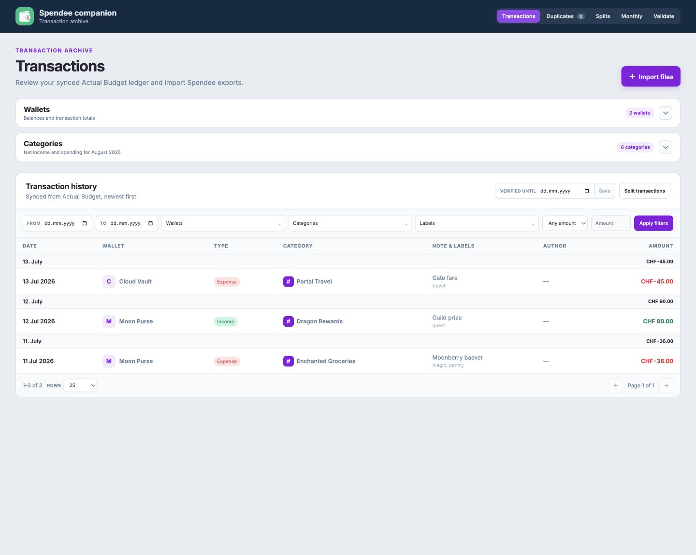
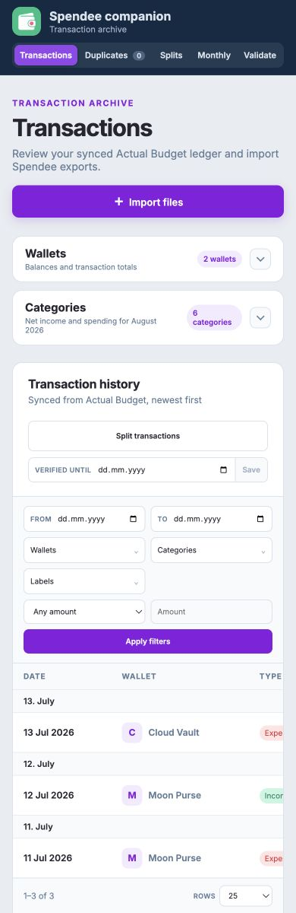

# Spendee

> [!IMPORTANT]
> **This entire repository—including the application, design, tests, documentation, and deployment setup—was made with AI.**

A private, self-hosted companion for Spendee transaction exports. Upload one or
more `.xlsx` or `.csv` files, keep every exported field in SQLite, browse
transactions with server-side pagination, and safely reconcile complete wallet
exports.



<details>
  <summary>Mobile layout</summary>

  
</details>

## What it does

- Imports Spendee's `Date`, `Wallet`, `Type`, `Category name`, `Amount`,
  `Currency`, `Note`, `Labels`, and `Author` columns.
- Accepts mixed XLSX/CSV batches in one upload, including valid header-only exports.
- Continues processing the rest of a batch when an individual file is invalid.
- Preserves import batch, source filename, source row, raw row data, and import
  timestamp for traceability.
- Identifies a transaction by its normalized date/time string, type, and wallet.
- Stores unchanged repeat occurrences in `duplicates`, linked to the original
  transaction.
- Offers a **Full import** mode for complete, single-wallet exports. It
  atomically removes that wallet's existing transactions and imports the fresh
  snapshot while leaving every other wallet untouched.
- Shows the current transaction-derived total for every wallet on the homepage,
  with a dedicated paginated activity page for each wallet. Collapsed dashboard
  directories provide quick access to every wallet and category.
- Supports a persisted starting amount per wallet and currency; wallet totals
  combine that starting amount with all active transactions.
- Links every category to a cross-wallet detail page with paginated matching
  transactions and a configurable spending-by-tag pie chart. Unselected and
  untagged spending is grouped into `Other`.
- Filters transactions by date range, multiple wallets, types, categories,
  tags, authors, and absolute amount. Long option lists are searchable.
- Groups transaction tables by day with `Today`, `Yesterday`, or calendar-date
  headers and complete daily totals for the current view.
- Provides a compact monthly category report. Report columns can combine
  multiple categories and optionally include color-coded budgets.
- Splits any selection of transactions across a configurable number of shares,
  with additional positive or negative custom positions and live totals.
- Persists split snapshots independently from the transaction ledger. Saved
  splits can be reviewed, deleted, and downloaded as an A4 PDF.
- Provides an English-first i18n message and formatting layer across the app.
  Each split persists its selected language so its PDF copy, dates, and numbers
  render through the matching locale catalog. Additional translations can be
  added without changing the split schema or PDF layout.
- Paginates transaction, duplicate, wallet, and category lists on the server and
  stores data in a WAL-mode SQLite database.
- Exposes the same data through an MCP Streamable HTTP endpoint. Data tools are
  read-only, with one explicit file-import tool.

Each uploaded file represents one wallet when **Full import** is enabled. A
full-import batch may contain multiple files, but the same wallet may only
appear in one file.

## Run locally

Requires Node.js 22 or newer.

```sh
npm install
npm run dev
```

Open <http://localhost:3000>. By default the database is created at
`./data/spendee.db`. Set `SQLITE_PATH` to use another location.

```sh
SQLITE_PATH=/absolute/path/spendee.db npm run dev
```

## Test and build

```sh
npm test
npm run test:coverage
npm run test:e2e
npm run build
```

The test suite covers imports, duplicate persistence, full-wallet replacement,
wallet and category reporting, filters, monthly reports, split persistence, and
PDF generation. It also exercises every MCP read tool and file import, the Streamable HTTP
MCP endpoint, API route validation and workflows, and server-rendered UI shells
using entirely synthetic fantasy fixtures. CI enforces minimum coverage of 95%
for lines, 90% for functions, and 80% for branches across server and library
code.

The Playwright end-to-end suite runs the complete fantasy-data journey in
desktop and mobile Chromium: CSV import, transaction verification, wallet and
category details, settings dialogs, split creation, and PDF download links.
Playwright starts the app with an isolated temporary SQLite database, so no
personal data is read or modified. Install its browser once with
`npx playwright install chromium` before running the suite locally.

## Docker

```sh
docker build -t spendee .
docker run --rm -p 3000:3000 -v spendee-data:/data spendee
```

The container exposes port `3000`, stores its database at
`/data/spendee.db`, and provides a health endpoint at `/api/health`. A
`compose.example.yml` is included for a persistent deployment.

## MCP server

Connect an MCP client to:

```text
https://your-spendee.example.com/mcp
```

The endpoint uses stateless Streamable HTTP with JSON responses. Its data tools
are read-only: overview and filter options, filtered/paginated
transactions, duplicates, wallets, category details, Monthy reports,
and splits. The `import_transaction_files` tool accepts one to ten XLSX/CSV
files as base64 using `{ filename, contentBase64 }`; set `full: true` to replace
each file's single wallet. No other tool can mutate data.

## License

[MIT](LICENSE)

### Third-party assets

The category icons in `public/category-icons` are official Spendee assets
retrieved from `api.spendee.com`. They remain the property of their respective
owner and are not covered by this repository's MIT license.
